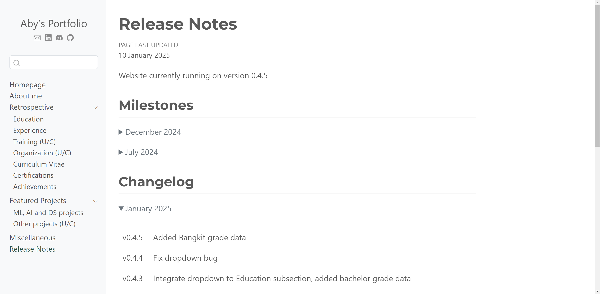

# My Portfolio
Website-based personal portfolio built with <a href="https://quarto.org/">Quarto</a> and deployed with GitHub Pages.

  

## References
[1] Hand, N. (2023). *From Notebooks to the Web: Quarto & GitHub Pages*. <<a href="https://musa-550-fall-2023.github.io/content/week-9/lecture-9A.html">https://musa-550-fall-2023.github.io/content/week-9/lecture-9A.html</a>> 
[2] Vasania, I. (2023). *Ishank Vasania - Portfolio*. <<a href="https://ishank09.github.io/profile">https://ishank09.github.io/profile</a>> 
[3] Wijaya, A.A. (2023). *Personal Website using Jupyter Notebook and Quarto* <<a href="https://adtarie.net/posts/007-quarto-python-tutorial/">https://adtarie.net/posts/007-quarto-python-tutorial/</a>>